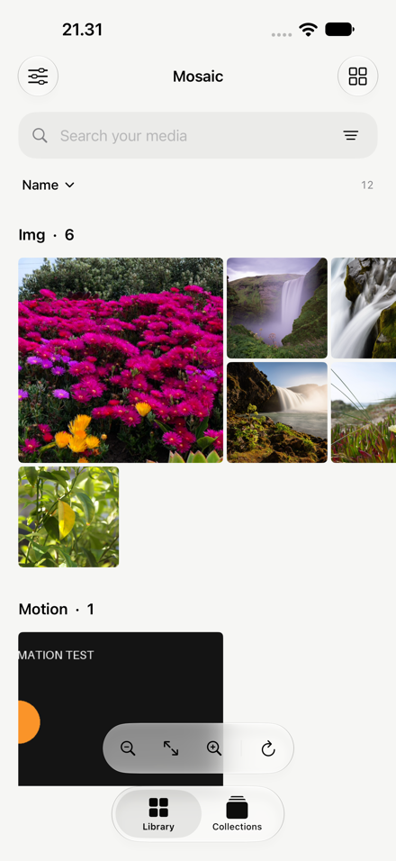
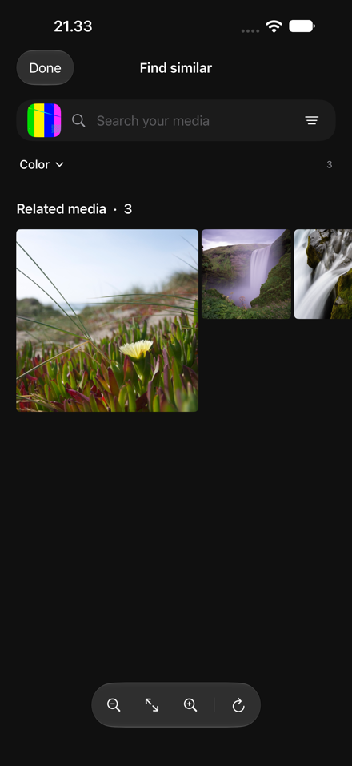

<div align="center">

# Mosaic

**A quieter home for your photos, GIFs, and films.**

Native iPhone and iPad media browsing, organization, and playback.<br>
Local first. Open source. No Mosaic account.


[Getting started](#getting-started) · [What works](#what-works) · [Cloud storage](#cloud-storage) · [Development](#development) · [Roadmap](ROADMAP.md) · [Privacy](PRIVACY.md)

</div>

<p align="center">
  
  
</p>

Screenshots use simulator sample media. No sample media ships with the app.

## What works

### Library

- Photos access with full or limited permission, plus media opened through Files.
- Recursive discovery in folders you explicitly connect—including nested Downloads folders.
- Horizontal or vertical gallery browsing with free momentum scrolling, adjustable density, date grouping, search by filename, format, year, or analyzed content, and sorting.
- Favorites, named collections, multi-selection, and quick organization actions.
- Full-screen viewing with pinch/double-tap zoom, swipe paging and swipe-down to close, GIF/APNG playback, Live Photos, metadata, and sharing. Compact landscape controls preserve media space at large text sizes; canvas grouping and zoom move into menus.

### Mosaic canvas

Choose the **Mosaic button in Library**. Library and Collections are the two main destinations; Files and cloud sources live in Settings → Connections.

A free-panning, zoomable two-dimensional canvas arranges media as islands grouped by **color**, **theme**, **visual similarity**, **name**, or **text sentiment**. Islands are packed into a roughly square world and color islands follow the color wheel, so you can pan in any direction; pinch, double-tap, or use **Show all** for a map-like overview. Search filenames, recognized text, and analyzed content ("beach", "dog", "blue", "2024"), then narrow by media type, favorites, or source.

**Tap any tile to explore.** The canvas re-centers on that item as a large reference tile, with its closest matches spiraling outward: the farther you pan, the less similar the media. Switch between Similar, Color, Theme, and Name matching with the chips. Tap another tile to hop again; Back walks the trail and restores each previous viewport. Tap the reference (or **Open**) to view it full screen, or long-press any tile for Open, Explore similar, and Favorite. **Find similar** in the viewer and gallery opens the same discovery view.

The canvas recycles cells in both axes. Geometry is computed once per content change in unscaled coordinates with a spatial hash; zooming only rescales the queried region, so pinching costs work proportional to visible tiles. Photos thumbnails for upcoming tiles are prefetched, tiles request resolution appropriate to the zoom level, and analyzed dominant colors paint placeholders before pixels arrive.

Analysis runs on-device in the background whenever **Analyze photos on this iPhone** is on (Settings), newest first, with bounded concurrency. It pauses when Mosaic leaves the foreground and slows under thermal pressure or Low Power Mode. Each item gets a dominant color palette, Apple Vision scene labels mapped to themes, and a Vision feature print for semantic similarity, all computed from ~300 px thumbnails. Photos requests never download iCloud originals, and cloud-only Files are skipped. Descriptors are cached on disk and checkpointed. When new analysis is ready, a **New matches ready** pill offers to refresh rather than rearranging tiles under your finger. Vision scene and feature models require a physical device; on Simulator, color and composition analysis still work.

Similarity is visual and semantic resemblance, not face identification. Sentiment uses filenames and optional recognized text; it does **not** infer anyone’s emotions. Items that have not been analyzed remain visible in **Not analyzed**, and are never presented as visual matches.

### Auto organization

Choose **Library → ••• → Auto organize**, or select a batch first. Preview generated names using `{date}`, `{type}`, `{sequence}`, and `{original}`; extensions are preserved and name collisions receive a numeric suffix. Dates use UTC for stable results across time zones. Group the batch into collections by month, media type, original name, cached color, or theme.

The default **In Mosaic** mode changes local display names and collection memberships. The original filename remains available in Details. **Undo** restores the last batch's prior names and memberships, including after a restart; later manual additions are retained. Choose **Original files** to rename/move actual files within their connected folder grant. Grouped files go into `Mosaic/<group>/`; without grouping, renames stay in the original directory. Preview shows the exact destination paths, then a separate Move files action confirms the batch. Photos-library items and individually opened files are excluded from physical moves; connect their parent folder through Settings first.

Moves use Apple file coordination, reject symlink escapes, and never overwrite a destination. Favorites, collection memberships, playback positions, and text indexes follow the new reference. Each move has a durable intent journal, startup recovery, per-file failure reporting, and a persisted Undo list. Undo also refuses collisions or changed source files. Cloud providers can reject moves or require connectivity; test with your provider before a large batch. Empty directories created by a move remain after Undo.

No background rule silently reorganizes your library. Color uses existing analysis, with unavailable descriptors placed in Unsorted.

### Player

Video plays edge to edge under one set of floating glass controls that fade after three seconds of playback and return when paused, when scrubbing, at the end of a video, or while VoiceOver is running. Tap the picture to show or hide them.

- A large play/pause button between skip back and skip forward, plus a scrubber with buffered range and elapsed/remaining time (tap the time to switch).
- Double-tap the left or right third to skip; repeated taps accumulate. Press and hold for temporary 2× speed. Pinch to switch between fit and fill.
- One-tap speed, subtitle and audio-track selection, Picture in Picture, and mute; loop, lock, and the full playback panel live in the ⋯ menu.
- The viewer pages horizontally like Photos, following your finger and previewing neighbors from cached thumbnails. Swipe down to close, swipe up for details. Zoomed photos never page.

Playback uses AVFoundation with an `AVPlayerLayer`, keeping HDR rendering, AirPlay, and system Picture in Picture where supported by the asset and device.

Mosaic also offers:

- Saved playback position and configurable autoplay.
- Configurable skip interval, exact time seeking, and frame stepping.
- Speed selection from 0.25× to 3×, fit/fill, video repeat, and A–B repeat.
- A sleep timer and control lock.
- External UTF-8 SRT/WebVTT subtitles with timing adjustment.
- An advanced playback panel that keeps the main viewing surface compact.

**Codec support is native Apple support, not VLC’s full decoder catalog.** MP4/MOV/M4V containers with supported tracks play natively. Other containers can be discovered and opened, but MKV, AVI, WebM, legacy codecs, or particular track combinations may require another app. Unsupported local media offers an action to share/open the original. An integrated alternate decoder is future work; Mosaic does not bundle VLCKit today.

Images use iOS/ImageIO support for JPEG, HEIC, PNG, TIFF, BMP, WebP, and supported RAW formats. GIF/APNG animate; Live Photos use PhotoKit. RAW/camera and HDR compatibility vary by device and OS. Animated WebP is currently displayed as a still image.

### Settings

Customization, connections, permissions, AI, playback preferences, and technical explanations live in **Settings**, keeping the browsing screens focused on media.

- System/light/dark appearance and true monochrome.
- Gallery direction and density.
- Folder discovery and cloud connections.
- Playback and skip preferences.
- Opt-in, on-device text recognition using Apple Vision. Index local photos in foreground batches; recognized text becomes searchable. No model-provider API or key is needed.

## Getting started

1. Open `Mosaic.xcodeproj` with **Xcode 27 or later**.
2. Select the shared **Mosaic** scheme and an iPhone or iPad simulator.
3. Build and run. The app targets **iOS/iPadOS 26+**.
4. On a physical device, choose your own signing team and a unique bundle identifier.
5. Connect Photos, open individual files, or use **Settings → Connections → Folders & discovery** to select a folder.

There are no external package dependencies or backend services to configure.

### Discovery on iOS

Mosaic can discover everything in the Photos library you authorize, and recursively scan the folder trees you select. It rescans connected folders on launch, return to the foreground, pull-to-refresh, or a manual scan.

**iOS does not allow a third-party app to search the entire phone.** Other apps’ private containers, unselected folders, and unavailable provider locations cannot be scanned. Select Downloads or a broader accessible parent folder once to include its nested folders. Some Files providers restrict directory access or require connectivity.

Originals stay in their current locations unless you explicitly choose Original files in Auto organize and confirm the preview. Removing a collection, forgetting a file, or disconnecting a folder does not delete original media.

## Cloud storage

### Nextcloud, Proton Drive, Google Drive, and iCloud Drive

Use **Settings → Connections → Cloud storage**. Install and sign in to the provider’s iOS app, then enable its location in **Files → Browse → ••• → Edit**. Select files through the system picker; connect a folder where the provider supports folder grants.

The provider owns authentication, encryption, and downloads. Mosaic only receives access to the files/folders selected by the user. Provider integration is not direct account-wide OAuth access.

Proton Drive’s Files integration depends on the installed version. If its location is unavailable, export the desired media to Files from Proton Drive first, then open or connect that location. Mosaic does not bypass Proton’s encryption or ask for its account password.

### S3 and compatible endpoints

Add a connection with an HTTPS endpoint, bucket, region, and read credentials. Both path-style and virtual-hosted addressing are supported, as are optional temporary session tokens.

- Credentials are stored in this device’s Keychain, not in source files or UserDefaults.
- The browser uses paginated `ListObjectsV2` requests and folder prefixes.
- Object access uses Signature V4 URLs generated when needed; signed URLs are not persisted.
- Videos stream through the native player. Images up to 100 MB are temporarily downloaded for viewing and removed on dismissal. Listing and image transfers enforce actual byte limits, use ephemeral sessions, and reject redirects; listings also have XML depth, field, and object-count limits.
- Connections are read-only. Required S3 permissions are `s3:ListBucket` and `s3:GetObject` for the chosen bucket/objects.
- Disconnecting removes saved credentials; it changes nothing on the server.

Use the bucket’s correct regional endpoint. Expired session credentials require reconnecting. S3 browsing is currently separate from local collections and Mosaic analysis; it does not automatically crawl or download a bucket. Server compatibility and real credentials require integration testing against your provider.

## Development

```text
Mosaic/
  Models/        Stable references, archives, grouping, subtitle parsing
  Services/      PhotoKit, persistence, file access, discovery, playback, S3, analysis
  Components/    Reusable thumbnails, native media surfaces, recycled canvas
  Features/      Library, Mosaic, collections, batch organization, viewer, settings
  Theme/         Neutral surfaces and restrained glass controls
MosaicTests/     Persistence, format classification, S3 signing, discovery,
                 subtitle parsing, grouping, rename/move/Undo recovery, security regressions,
                 and large-library clock/memory benchmarks
MosaicUITests/   Isolated UI journeys, accessibility audits, and screenshot attachments
scripts/         Synthetic media fixtures and reproducible vector icon rendering
```

### Architecture and performance

`LibraryStore` is the main-actor source of truth. Photos identifiers and security-scoped bookmarks refer to originals. `ArchiveRepository` serializes atomic metadata writes on an actor. A corrupt archive is preserved rather than silently replaced.

Photos thumbnails use `PHCachingImageManager`; file thumbnails use downsampling and a 64 MB cost-bounded cache, with at most three concurrent decodes. Grid work is lazy. Viewer images are bounded to display-oriented resolutions, while videos use native streaming/decoding. Cancellation and identity checks prevent old requests from painting reused cells or replacing newer viewer state. Folder discovery reads metadata on an actor and preserves previous results if a provider is unavailable.

`MosaicCanvasLayout` caches unscaled geometry and uses a spatial hash to return only visible tiles; zoom rescales lazily per query. Similar grouping compares against at most 40 representatives, avoiding an all-pairs quadratic comparison; feature prints are stored as L2-normalized Int8 vectors so similarity is a dot product. Analysis is off the UI actor and cached. This is an implementation strategy, **not yet a measured frame-rate guarantee** for large real-world libraries.

Comments describe ownership, cancellation, scope lifetimes, and algorithm choices. Keep those contracts intact when extending the app. See [CONTRIBUTING.md](CONTRIBUTING.md).

### Tests

Use **Product → Test** in Xcode, or:

```sh
xcodebuild test \
  -project Mosaic.xcodeproj \
  -scheme Mosaic \
  -destination 'platform=iOS Simulator,name=iPhone 18 Pro Max'
```

Choose an installed simulator name if yours differs. Tests use temporary files and AWS’s public signing example; they do not contact a cloud service or require credentials.

UI tests launch with `--ui-testing`, generating 60 procedural images in a separate temporary archive. This fixture is compiled only in Debug builds, resets on launch, and never requests Photos or provider access. Tests exercise discovery round trips, batch preview/apply/Undo, horizontal gallery transitions, light/dark accessibility semantics and hit regions, and the largest accessibility text size. Screenshots are retained in the Xcode test result.

The iOS 27 text-clipping audit falsely flags the native **Insert field** menu label at XXXL. A screenshot/hierarchy review verified the full label; the test excludes only that issue while also requiring the control to be hittable and fully above the pinned action button. Other clipping and description failures remain failures.

Performance tests record five clock/memory iterations for 1,000 viewport queries in a 50,000-item canvas, name grouping and collision-heavy renaming of 10,000 items, plus empty-query filtering. Generous time ceilings detect major algorithmic regressions; simulator measurements do not establish real-device frame rate, battery use, or thermal behavior.

October 5, 2026 reference measurements (Debug build, iPhone 18 Pro Max / iOS 27 simulator, five-iteration averages):

| Operation | Mean time |
| --- | ---: |
| 1,000 visible-region queries, 50,000-item canvas | 20 ms total |
| Name grouping, 10,000 items | 25 ms |
| Collision-safe rename planning, 10,000 items | 91 ms |
| Empty-query filtering, 10,000 items | 3.7 ms |

Viewport measurement excludes the one-time layout construction. XCTest also records process memory; it does not measure a full gallery's sustained device memory or scroll hitch rate. Keep `.xcresult` artifacts when comparing machines or changes.

Create synthetic visual fixtures with Pillow and FFmpeg:

```sh
python3 scripts/make-test-media.py /tmp/mosaic-media
ffmpeg -f lavfi -i testsrc2=size=1280x720:rate=30 \
  -f lavfi -i sine=frequency=440:sample_rate=44100 \
  -t 12 -c:v libx264 -pix_fmt yuv420p -c:a aac /tmp/mosaic-media/test-video.mp4
xcrun simctl addmedia booted /tmp/mosaic-media/*.jpg \
  /tmp/mosaic-media/motion.gif /tmp/mosaic-media/test-video.mp4
```

### Verification and remaining work

The October 5, 2026 Xcode MCP full run passes **73 test cases**, including eight UI journeys/audits, six hardening regressions, and four performance benchmarks. Development uses Xcode’s MCP build, test, and simulator-interaction tools. Automated tests also cover the published [AWS Signature V4 vector](https://docs.aws.amazon.com/AmazonS3/latest/developerguide/sigv4-query-string-auth.html), atomic archive round trips and corruption, nested discovery, bookmark traversal rejection, collision-safe file moves, symlink confinement, move-journal recovery, persistent batch Undo, and subtitle boundaries. New hardening regressions exercise malformed cloud listings, oversized chunked responses, partial-download cleanup, cancelled viewer loads, and file-read confinement.

This is a focused source review and simulator regression pass, not a comprehensive security assessment or a guarantee of stability on every media format and provider.

Before a public release, test on physical iPhones/iPads with large libraries, cloud-only assets, disconnected providers, HDR/RAW samples, Bluetooth/AirPlay, Picture in Picture, VoiceOver, larger text sizes, memory pressure, and long-running playback. Real S3 and third-party provider account flows require credentialed device testing. External SRT/WebVTT captions currently render in Mosaic’s viewer, not inside system Picture in Picture. ASS/SSA, external audio, equalization, Chromecast, and a full alternate video decoder are not implemented.

## Privacy and license

No advertising, analytics, Mosaic account, or Mosaic-hosted upload service. See [PRIVACY.md](PRIVACY.md) for local storage, cloud downloads, and sharing details.

Mosaic is released under the [MIT License](LICENSE). Apple frameworks remain subject to their platform terms. Mosaic is not affiliated with VLC or VideoLAN.
